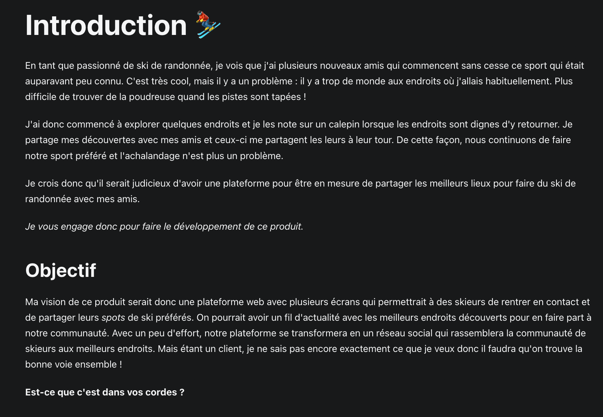
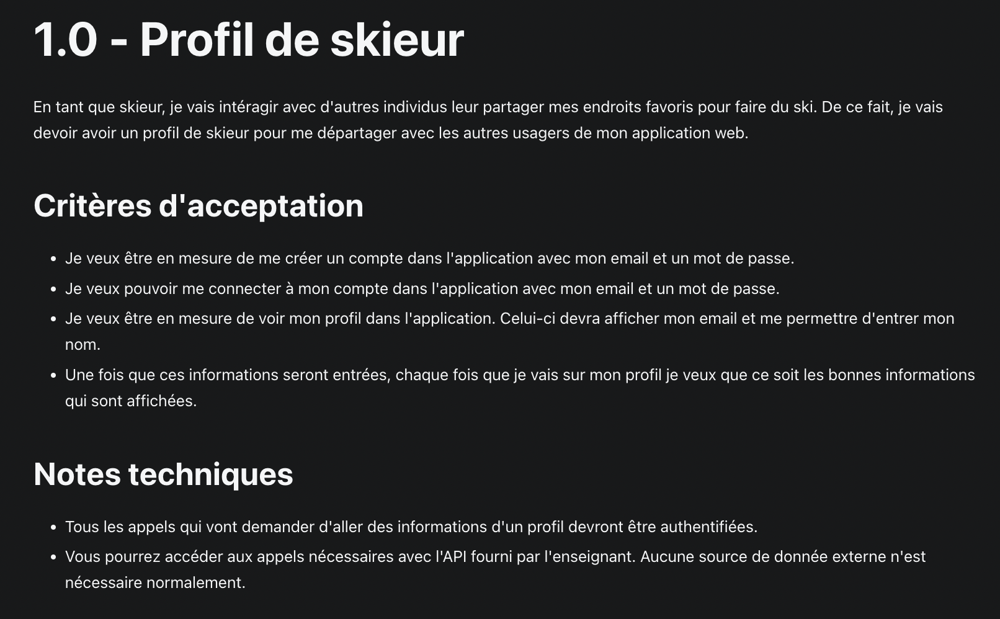
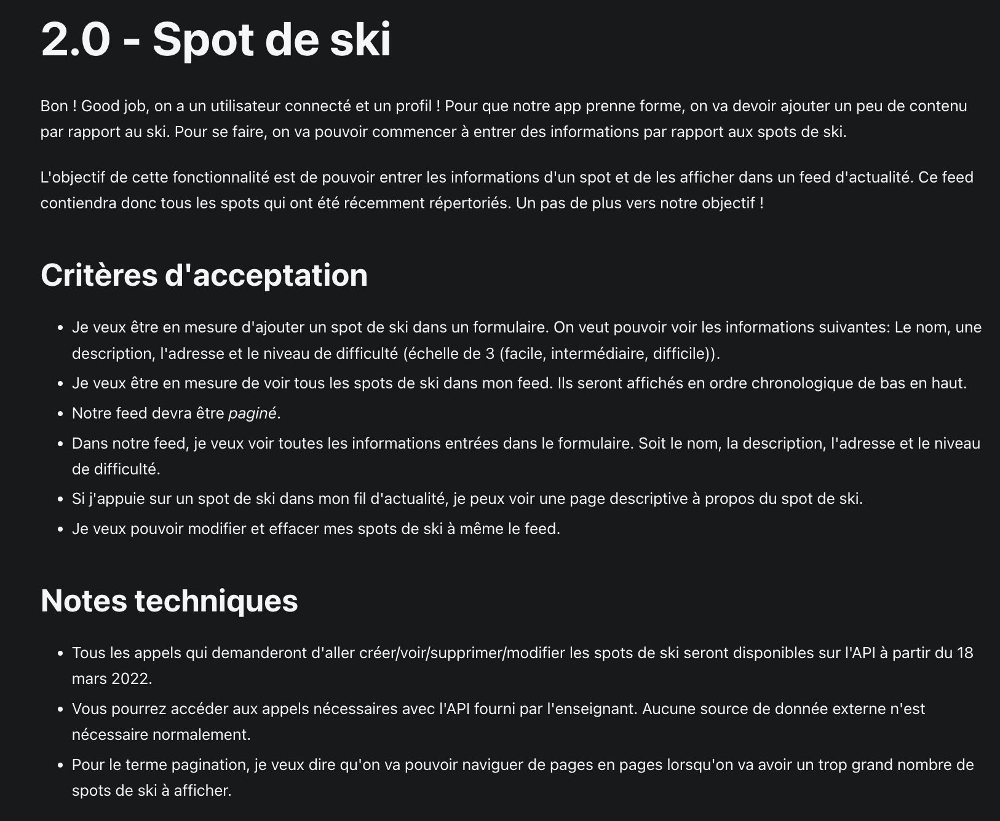
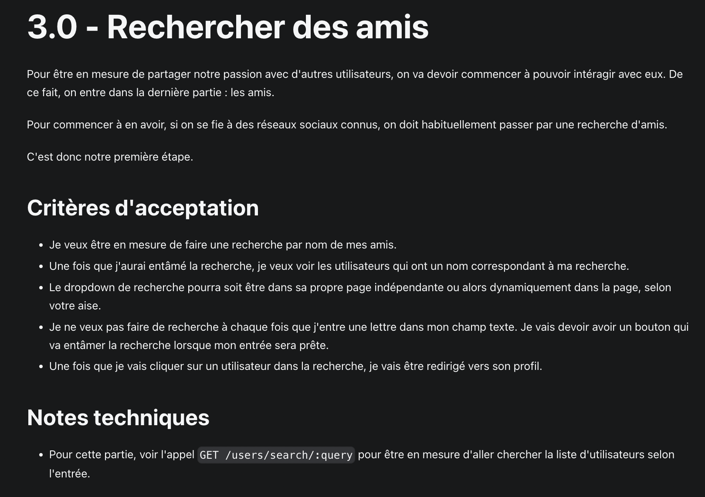
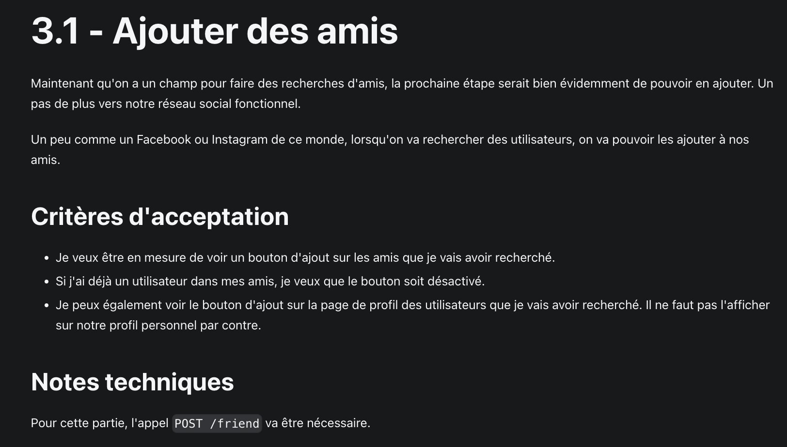

# Description 

Projet réalisé en équipe de 5 dans le cadre de mon AEC en développement web. 

Nous devions réaliser une plateforme web avec plusieurs écrans qui permettrait à des skieurs de rentrer en contact et de partager leurs spots de ski préférés.

Je me suis occupée de la partie graphisme et de l'intégration. 

# Démonstration du projet 

[Consulter le projet sur mon site web personnel (lien à venir)](#)